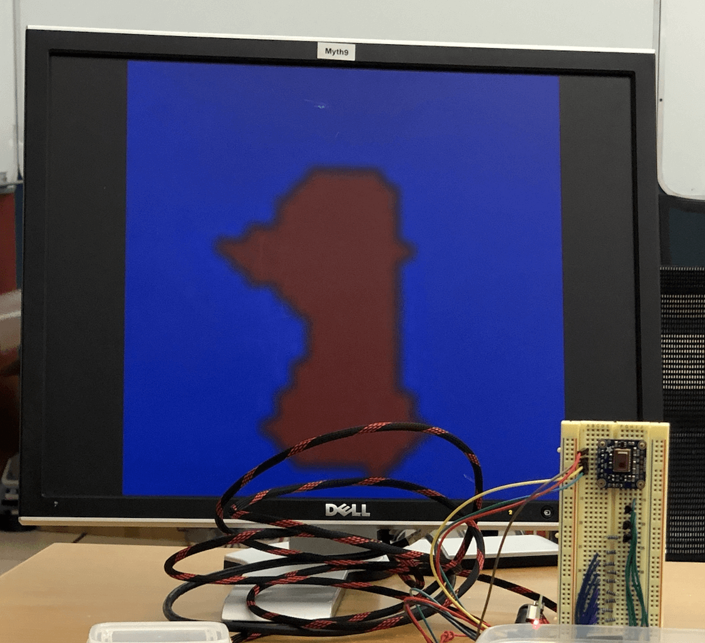

# Stick Figure Simulator

by [Andy Khuu](https://github.com/AndyLKhuu) and [Lydia Chan](https://github.com/LydiaChan528)

Stick Figure Simulator is a lenses through which you can see yourself as a stick figure! Based on our love for
stick figures and animations, this project allows you to become a stick figure in a fun and interactive way - 
it's like being in your own comic. 

We used a thermal camera from Adafruit in order to track the motion of the user, based on the person's head and arms, 
and draw them as a stick figure in the frame. The player can interact with on-screen elements, like balls falling from the sky. 
But it's game over if they are hit.

Below is a breakdown of what each of us designed and created for this project:
### Both

- Interface with thermal camera through I2C protocol

- Implement motion and redrawing of game elements

  
  
- Integrate all parts  
  
  
 
### Andy: 
- Interpolation of thermal camera data from 8x8 to 29x29  
  
  
    
  
    
  
- Game mechanics: element boundaries and collision detection  
### Lydia:  
- Stick Figure: heuristic head and arm detection from camera data  
  
- Graphics: rendering lines, circles, and stick figure**  
  
  
  

Sources  
(*)We used the I2C driver in the CS107E library. 
(**)The circle-drawing algorithm is based the Mid-Point Circle Drawing Algorithm from GeeksforGeeks. 

